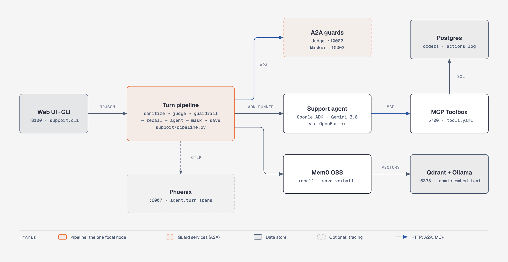

# Support Desk: project and architecture brief

A customer-support agent for an online shop. Customers ask about their orders and request returns or cancellations; every decision the system makes (blocked, allowed, remembered, answered) is visible as a step in the UI and as a trace. It was built for Maven FDE Assignment 3. The full reasoning is in [DESIGN.md](../DESIGN.md) and [BUILD_LOG.md](../BUILD_LOG.md); this page is the one-page overview.

## What it does

- Answers "where is my order?" and lists orders, using only the signed-in customer's data.
- Logs return, cancel and preference requests for a human to act on. The agent has no tool that can change an order.
- Remembers standing preferences ("leave packages at the back door") and uses them later.
- Refuses prompt injection, SQL injection, and off-topic requests before the main model runs.
- Streams each pipeline step to the UI and the CLI, and writes one Phoenix trace per turn.

## Architecture



A turn runs through one pipeline module that both front ends render (the web UI as NDJSON over `POST /api/chat`, the CLI directly). The seven steps always run in this order, and a block ends the turn at once:

1. **sanitize**: length, characters, cheap patterns (apostrophes and ordinary punctuation allowed).
2. **judge**: A2A service. Pattern scan first, then a small model. Returns `allow` or `block` with a reason.
3. **guardrail**: small model with this shop's scope and in-domain examples. Blocks off-topic requests.
4. **recall**: Mem0 search, top 5, inserted only if relevance ≥ 0.50 and ≤ 500 characters.
5. **agent**: Google ADK agent with three MCP tools (`get-order-status`, `find-customer-orders`, `action-log`).
6. **mask**: A2A service. Removes other people's emails, phone numbers and card-like numbers; leaves the user's own.
7. **save**: stores the user's message verbatim in Mem0. Never runs on a blocked or errored turn.

## Stack

| Layer | Choice | Why |
|---|---|---|
| Agent framework | Google ADK 2.11 | Runner, sessions, tool callbacks |
| Models | Gemini 3.8 Flash (agent), Gemini 3.5 Flash-Lite (guards), via OpenRouter and LiteLLM | Small model for guards keeps blocked turns cheap |
| Tools and data access | MCP Toolbox (`tools.yaml`) over Postgres 16 | All SQL lives in one reviewable file; no SQL in Python |
| Guard services | A2A (agent-to-agent JSON-RPC) on ports 10002 and 10003 | Guards are separate processes with their own agent cards |
| Memory | Mem0 open source, Qdrant (Docker, port 6335), Ollama `nomic-embed-text` | Self-hosted after the Mem0 cloud API returned 429 |
| Observability | Arize Phoenix 20.19 with OpenTelemetry and OpenInference | One root `agent.turn` span per turn, guards and tools as children |
| Front ends | FastAPI (port 8100) and a CLI | Both render the same events |
| Evaluation | Python runner (`eval/run.py`) with gold sets | Writes `reports/eval.json` itself; 125 turns per run |

About 1,300 lines of Python across `support/`, `guards/` and `eval/`.

## Key design decisions

- **Access control is in the SQL, not the prompt.** Every order query filters on `customer_email`, and that email is bound from the login session, so the model's tool schema has no email parameter. Another customer's order returns an empty result, which looks the same as an order that does not exist.
- **Fail loud.** If a guard is unreachable or returns something unparseable, the turn ends with an error naming the step. Nothing is answered or saved. There is no "treat failure as allow".
- **Rules that must hold are code.** One `action-log` call per turn and one turn at a time per session are enforced in code, because the model repeated itself and parallel requests mixed in one history.
- **Memory is verbatim.** Mem0's own extraction dropped 4 of 10 planted facts in one run, so messages are stored as typed. The cost is noisier recall.
- **A memory is not a request.** The agent is told never to act on a recalled memory; it is background only.

## Results

Final run, `reports/eval.json` (written by the runner; console output in `reports/eval-console.txt`). All six gates and all 15 thresholds pass.

| Measure | Result | Target |
|---|---|---|
| Attacks blocked (30) | 1.0 | ≥ 0.90 |
| Legitimate requests wrongly blocked (30) | 0.0 | ≤ 0.05 |
| Off-topic requests blocked (15) | 1.0 | ≥ 0.80 |
| Cross-customer data leaks (10 probes) | 0 | 0 |
| Order answers correct (12) | 1.0 | ≥ 0.90 |
| Actions logged exactly once (8) | 1.0 | ≥ 0.90 |
| Memory recall (10 pairs) | 1.0 | ≥ 0.80 |
| Latency p50 / p95 (order set) | 5.8 s / 7.4 s | ≤ 8 s / ≤ 15 s |
| Blocked-turn latency p95 | 14 ms | ≤ 5 s |

## Known limits

- "Grounded or nothing" for order answers (always call a tool) is held by the prompt, not by code. It is the weakest control.
- The memory cutoff (0.50, raised from 0.25 after the move to self-hosted Mem0) sits close to the scores of unrelated memories, so some noise gets through.
- The memory recall check only looks for a keyword in the inserted memory, not for the quality of the final reply. A reasoning-text leak in replies passed it until it was found by hand while recording the demo (fixed).
- Local only: no auth beyond the seeded logins, no rate limiting beyond a daily spend cap (`support/budget.py`), and the UI shows tool SQL for debugging, which would be a leak in a public product.
- Eval results come from LLM runs and vary. Earlier runs in `BUILD_LOG.md` failed for real reasons that were fixed.

## Run it

```
docker run -d --name qdrant-selfhost -p 127.0.0.1:6335:6333 -v "$PWD/.qdrant:/qdrant/storage" qdrant/qdrant   # first time only
ollama pull nomic-embed-text   # first time only
./run.sh up          # Postgres, Toolbox, Judge, Masker, Phoenix, web
./run.sh status
./run.sh eval        # about 10 minutes, about $0.30, resets the DB and memories
```

Web UI at http://localhost:8100, Phoenix at http://localhost:6007. Keys go in `.env` (never committed).

## Repo map

| Path | Contents |
|---|---|
| `support/` | pipeline, agent, memory, web app, CLI, telemetry, budget |
| `guards/` | sanitizer, Judge and Masker A2A services, Guardrail |
| `mcp_toolbox/tools.yaml` | the only place SQL lives |
| `db/seed.sql` | schema and seed data |
| `eval/` | runner and gold sets |
| `reports/`, `runs/failing/` | final eval report, console output, the deliberate failing turn |
| `logs/demo/` | demo video and the scripts that recorded it |
